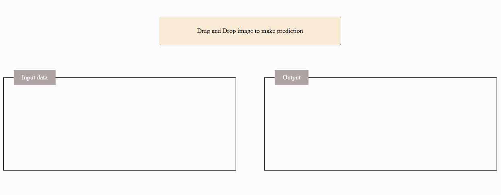
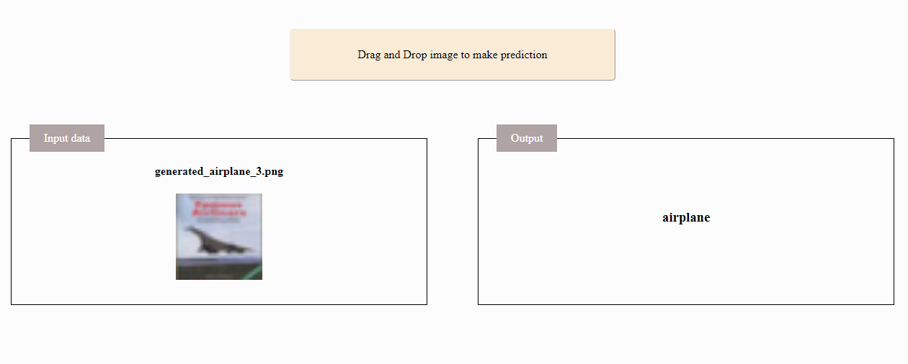

# Dash plotly interface for image classification

The ANN was trained on cifar_10 dataset with shape (None, 32, 32, 3), with None for the batch size.

Online simulation here: https://cifar-clf.mhannani.codes/

After prediction

